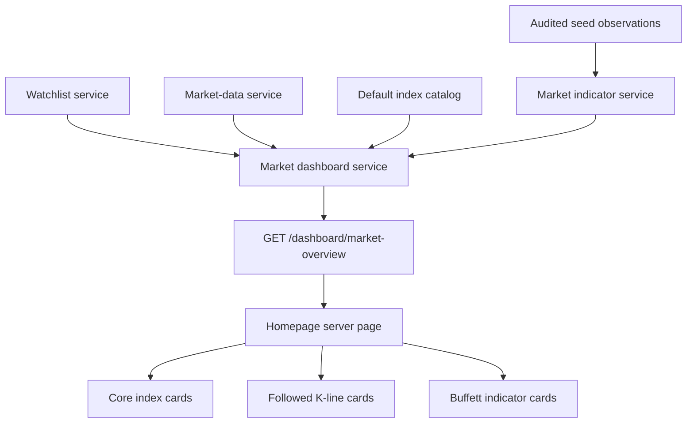

# Homepage market dashboard design

## Architecture

The homepage should consume one backend view model instead of stitching together many cross-domain calls in the React page. The backend owns market-dashboard aggregation, status classification, provider isolation, and reusable indicator storage.



## Backend boundaries

### Domain model

Add two generic valuation/macro indicator tables in `packages/domain/models.py`:

- `MarketIndicator`
  - `code`: stable machine code such as `buffett_indicator_us`
  - `name`: display name fallback from backend
  - `category`: first implementation uses `valuation`
  - `region`: `CN`, `HK`, or `US`
  - `unit`: first implementation uses `percent`
  - `description`: optional explanation
  - `display_order`: dashboard ordering
  - `is_active`: soft visibility switch
- `MarketIndicatorObservation`
  - `indicator_id`
  - `as_of`
  - `value`
  - `source`
  - `components_json`: auditable inputs such as market cap, GDP, unit notes, and source references
  - `created_at`

The model is intentionally broader than the Buffett Indicator so future PE/PB, yield spread, CPI, PMI, and risk indicators do not require another table family.

### Seeded real observations

The first implementation should seed auditable observations rather than automatically scrape external sources. A seed routine should upsert indicator definitions and observations, including source notes and component data.

Rules:

- If a value is not available in the seed data, return `no_data`.
- Never fabricate a value to satisfy the UI.
- Every available value must have `source`, `as_of`, and `components_json`.
- `components_json` should contain enough fields for the UI and tests to explain the ratio, for example `market_cap`, `gdp`, `ratio`, `market_cap_source`, and `gdp_source` when available.

### Index catalog

Create a code-owned catalog instead of a database table for the first implementation. Each entry should include:

- stable internal code, for example `cn_shanghai_composite`
- display name
- region
- market
- currency
- provider symbol map keyed by provider name
- display order

The confirmed list is:

1. Shanghai Composite
2. Shenzhen Component
3. ChiNext
4. CSI 300
5. CSI 500
6. Hang Seng
7. Hang Seng Tech
8. S&P 500
9. Nasdaq Composite
10. Dow Jones Industrial Average

The API contract must expose internal codes, not ambiguous provider symbols such as `000001`.

### Dashboard aggregation service

`packages/services/market_dashboard.py` should own the view-model assembly:

1. Build the date window for approximately three months of daily bars.
2. Load default watchlist items and select at most six active symbols; fallback to active instruments if the watchlist is empty.
3. Fetch bars for selected followed instruments with provider isolation.
4. Fetch bars for each catalog index through provider-symbol mapping.
5. Fetch latest Buffett Indicator observations for `CN`, `HK`, and `US`.
6. Derive latest close, daily movement, freshness, and status per item.
7. Return partial results if one item or section fails.

## API contract

Add `GET /dashboard/market-overview?provider=...` in `apps/api/routers/dashboard.py` and register it in `apps/api/main.py`.

Suggested response shape:

```json
{
  "generated_at": "2026-07-03T00:00:00+00:00",
  "provider": "yfinance",
  "range": {
    "timeframe": "1d",
    "start": "2026-04-03",
    "end": "2026-07-03"
  },
  "followed": {
    "scope": "watchlist",
    "items": []
  },
  "indices": {
    "items": []
  },
  "valuation_indicators": {
    "items": []
  },
  "diagnostics": []
}
```

Each followed/index item should contain:

- `code` for indices or `symbol` for instruments
- `name`
- `market` or `region`
- `currency`
- `status`: `ok`, `no_data`, or `unavailable`
- `freshness`: `fresh`, `stale`, `no_data`, or `unavailable`
- `latest`: latest close/as-of and derived movement when available
- `bars`: compact daily OHLCV bars for charting
- `source`, `provider`, and `effective_provider`
- `detail_path` for followed instruments

Each valuation indicator item should contain:

- `code`
- `name`
- `region`
- `category`
- `status`
- `value`
- `unit`
- `as_of`
- `source`
- `components`

## Frontend design

### Compact chart

Add `apps/web/components/compact-candlestick-chart.tsx` as a client component.

It should reuse `deriveOhlcBar` and `buildChartPoints`, render compact candlesticks, show MA20 and optional volume, and avoid the heavy interactive controls from the existing detail chart. Empty data should render a localized/prop-driven unavailable state instead of returning `null`.

### Homepage hierarchy

Update `apps/web/app/[locale]/page.tsx` so the first visible sections are:

1. Core market index cards
2. Followed K-line cards
3. Buffett Indicator / valuation indicator cards
4. Existing operational/data-health sections lower on the page

The server page should fetch `/dashboard/market-overview` and keep existing secondary data fetches only for lower sections that still need them.

### Localization

All new user-visible strings belong in `apps/web/messages/en.json` and `apps/web/messages/zh.json`. Movement wording should continue to use explicit text and signs, not color as the only signal.

## Compatibility and migration notes

- Alembic migration must support the existing SQLite test setup and PostgreSQL-compatible production schema.
- Existing market-data endpoints remain unchanged.
- Existing instrument detail chart remains the detailed chart experience.
- Provider failures are localized to dashboard items and should not fail the whole dashboard response.

## Rollback considerations

- The homepage can fall back to older lower-page diagnostics if the dashboard API fails by rendering an explicit error/empty market-dashboard state.
- The new indicator tables are additive and should not affect existing reports, fundamentals, market-data, or watchlist flows.
- The index catalog is code-owned in this iteration and can be adjusted without database migration.
