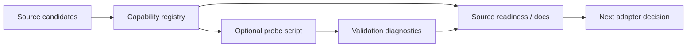

# Design: China Macro Source Validation

## Architecture

This task adds a validation layer before any production China macro adapter:

The MVP is validation-only. It should not persist `MarketIndicatorObservation` rows, should not add scheduled refresh, and should not let AI cite source candidates, links, or probe diagnostics as evidence.

## Boundaries

- Registry boundary: create or extend a service-level source-capability registry that records China macro source candidates and their validation status. Prefer a plain dataclass/tuple service module over a database table for the MVP unless existing code strongly suggests persistence.
- Probe boundary: provide a standalone diagnostic script that can run with `--no-network` by default and `--live-network` only when explicitly requested. It should report `OK` / `WARN` / `FAIL` lines and sanitized details.
- Source-readiness boundary: source readiness may expose capability metadata as guidance, but candidate/probe status must not change `configured`, `evidence_count`, or `latest_as_of`.
- AI boundary: dashboard briefs, saved research briefs, and the market assistant must keep using only local observations, reports, news, and reviewed/citable source notes as citations.
- Documentation boundary: docs should explain the validation result, next adapter candidate, manual fallback, and citation boundary.

## Candidate Sources

Initial rows should cover:

| Candidate | Coverage | Expected Access | Initial Status |
|---|---|---|---|
| NBS China macro | GDP, CPI, PPI, PMI, industrial/activity indicators | official public site/API candidate | candidate |
| PBOC monetary statistics | China M2 / liquidity | public page/manual or official API candidate | manual_only or candidate |
| World Bank China macro fallback | GDP and annual macro context | public API | implemented or adapter_ready for selected low-frequency context |
| IMF / World Bank-style global macro fallback | GDP/CPI-like context if available | public API candidate | candidate |
| Trading Economics | broad China macro | vendor API | candidate, credentials/license required |
| AkShare/Tushare wrappers | convenience access to China macro/market data | library wrapper/vendor token | candidate, not official evidence by default |

The implementation can refine statuses from repository inspection and optional live probes. If a source blocks access or has unclear terms, mark it as `blocked`, `manual_only`, or `candidate`; do not force it into `adapter_ready`.

## Capability Contract

Each capability item should serialize to stable JSON-like payload fields:

- `id`
- `label`
- `authority`
- `region`
- `indicator_families`
- `indicator_codes`
- `access_mode`
- `adapter_status`
- `credential_required`
- `license_note`
- `freshness_policy`
- `collection_links`
- `validation`
  - `status`
  - `checked_at`
  - `summary`
  - `diagnostics`
- `citation_policy`
- `recommended_next_action`

Recommended enum values:

- `access_mode`: `official_api`, `public_page`, `manual_seed`, `vendor_api`, `library_wrapper`, `unsupported`
- `adapter_status`: `implemented`, `adapter_ready`, `candidate`, `manual_only`, `blocked`, `future`
- `validation.status`: `not_checked`, `ok`, `warning`, `failed`, `skipped`

## Probe Behavior

The probe should:

- default to no live network;
- accept a focused target such as `--source nbs`, `--source pboc`, or `--source all`;
- optionally run live checks only with `--live-network`;
- avoid writing database rows;
- avoid printing secrets, raw tokens, raw stack traces, or full provider payloads;
- treat unsupported or credential-gated sources as `WARN`, not fabricated success;
- produce deterministic output that can be asserted in script tests with fake probe clients.

Live probes may be shallow. The MVP needs enough evidence to decide whether a source is adapter-ready, candidate, manual-only, or blocked; it does not need to normalize full time series into observations.

## Integration Options

Preferred first slice:

1. Add `packages/services/source_capabilities.py` with static registry and serialization helpers.
2. Add `scripts/validate_china_macro_sources.py` for no-network summaries and opt-in live probe hooks.
3. Add a `source_capabilities` field to information-source readiness payloads or expose capability details through docs/runbook only if UI changes would be too large.
4. Update docs with current statuses and next adapter recommendation.

This keeps the work small, testable, and aligned with the existing no-data-safe evidence model.

## Compatibility

- Existing FRED and World Bank refresh scripts remain unchanged.
- Existing source-readiness fields remain backward compatible; any capability metadata must be additive.
- Existing seed import and Source Notebook workflows remain manual/audited fallback paths.
- Candidate capability rows must not appear in dashboard or assistant citation lists.

## Rollback

- Registry/docs/script changes can be reverted without touching persisted market data.
- If source-readiness payload integration creates frontend churn, keep the registry and docs but remove the additive payload field.
- If live probing proves unreliable, preserve no-network capability rows and document live probing as optional/manual.
