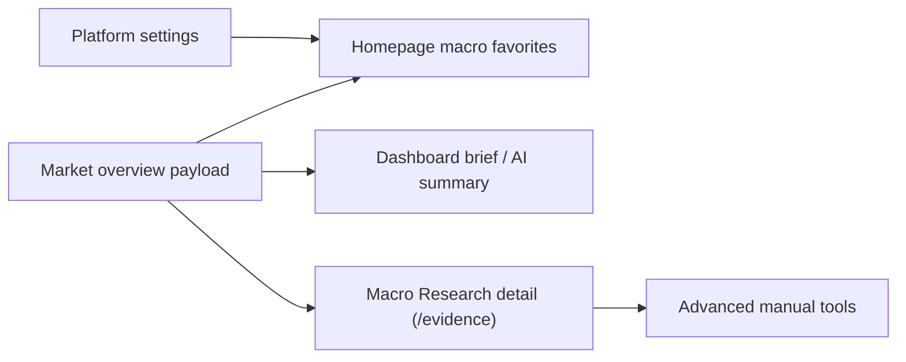

# Design: Homepage Macro Favorites And Macro Research Detail

## Architecture

This task keeps the existing data model and route structure, then changes the user's default path through the app:



The homepage becomes the quick daily cockpit. The existing `/evidence` route remains the deeper macro research detail page and keeps manual/source-review workflows secondary.

## Product Decisions

- Preserve `/evidence` for compatibility, but change visible navigation/page language toward "Macro Research" / "宏观研究".
- Put followed/favorite macro indicators on the homepage near the AI research summary and before lower-priority operational diagnostics.
- Treat Buffett Indicator as regional market-wide context, not a single-stock signal. Homepage defaults should show both US and mainland China Buffett Indicator rows when present.
- Use platform settings for the favorite macro indicator code list because this is a single-user app and settings already persist display/data preferences in `data/platform_settings.json`.
- Use a default favorite list when no preference exists. Recommended default:
  - `buffett_indicator_us`
  - `buffett_indicator_cn`
  - `buffett_indicator_hk`
  - `us_10y_yield`
  - `us_10y_2y_spread`
  - `us_cpi_yoy`
  - `us_m2_yoy`
  - `cn_m2_yoy`
- Keep manual seed import, Source Notebook, and research follow-up queue reachable as advanced tools. Do not delete backend, API, or component code.

## Data Flow

1. `GET /dashboard/market-overview` returns macro/valuation indicators, dashboard brief, information-source readiness, and source capability metadata.
2. Homepage reads platform settings and the market overview payload.
3. Homepage filters macro/valuation indicators by `favorite_macro_indicator_codes`.
4. If no favorite setting exists or none of the favorite codes match current payload rows, homepage falls back to the default favorite list and then to the first available indicators.
5. Each favorite row/card renders:
   - indicator name/code;
   - value or unavailable state;
   - as-of date;
   - source or no-data reason;
   - status badge;
   - link to `/evidence` for all macro/source details.
   Buffett rows should show their region prominently so US, mainland China, and Hong Kong readings are not mistaken for one global number.
6. Settings can persist the favorite code list as a text or compact control. The implementation should keep this UI modest and avoid full dashboard customization.

## Contracts

### Platform Settings

Additive field:

```json
{
  "favorite_macro_indicator_codes": ["buffett_indicator_us", "us_10y_yield"]
}
```

Rules:

- Normalize codes by trimming whitespace and removing empty entries.
- Preserve order because homepage should respect the user's priority.
- De-duplicate while preserving first occurrence.
- If absent, default to the recommended macro favorite list.
- Public settings may expose this list because indicator codes are not secrets.

### Homepage UI

- The module should be compact and scan-friendly, not a marketing-style hero.
- Do not imply that missing macro values are zero or stale trading signals.
- Missing values show source-gap wording and a link to macro detail.
- AI summary stays clearly bounded by available local evidence.

### Macro Research Detail

- Existing `/evidence` sections remain available.
- Manual source workflows stay behind an advanced/details affordance.
- Source capability rows remain guidance only. They must not be rendered as citations.

## Compatibility

- No route rename in this slice. Existing `/evidence` tests and links should continue to pass.
- `PlatformSettings` changes are additive. Existing settings files without the new field continue to work.
- Existing source-readiness and dashboard-brief citation semantics remain unchanged.
- Existing assistant safety boundaries remain unchanged.

## Risks And Mitigations

- Risk: homepage becomes crowded.
  - Mitigation: show only favorites with compact rows/cards and link to details for the full table.
- Risk: settings UI becomes too complex.
  - Mitigation: use a simple ordered text field or compact checkbox list derived from available macro indicators.
- Risk: source capability metadata is mistaken for evidence.
  - Mitigation: keep source capability display in detail/source-readiness context with explicit "guidance only" wording.
- Risk: existing dirty files confuse scope.
  - Mitigation: inspect current diffs before implementation and stage only files changed for this task.

## Rollback

- Remove the homepage favorite macro module while leaving market overview payload and `/evidence` unchanged.
- Remove `favorite_macro_indicator_codes` from platform settings helpers; old settings files remain compatible.
- Revert navigation label text without changing route compatibility.
