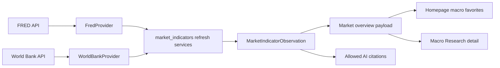

# Design: Official Macro Refresh Productization

## Architecture

This task should reuse the existing official-source refresh architecture instead of adding a parallel ingestion path.

The official providers fetch external source rows. Service-layer refresh functions normalize them into `MarketIndicatorObservationSeed` objects and reuse the existing audited observation upsert path. Frontend pages should keep reading only the market overview payload and platform settings.

## Existing Contracts To Preserve

### FRED

- Provider: `packages/providers/fred_provider.py`
- Service: `refresh_fred_macro_indicators(...)`
- CLI: `scripts/refresh_fred_macro_indicators.py`
- Initial mappings:
  - `DGS10` -> `us_10y_yield`
  - `DGS2` -> `us_2y_yield`
  - `T10Y2Y` -> `us_10y_2y_spread`
  - `CPIAUCSL` -> `us_cpi_yoy` through YoY calculation
  - `M2SL` -> `us_m2_yoy` through YoY calculation
- FRED requires `FRED_API_KEY`. Missing key should warn and write nothing.

### World Bank

- Provider: `packages/providers/world_bank_provider.py`
- Service: `refresh_world_bank_macro_indicators(...)`
- CLI: `scripts/refresh_world_bank_macro_indicators.py`
- Initial mappings:
  - `USA` + `CM.MKT.LCAP.GD.ZS` -> `buffett_indicator_us`
  - `CHN` + `CM.MKT.LCAP.GD.ZS` -> `buffett_indicator_cn`
  - `HKG` + `CM.MKT.LCAP.GD.ZS` -> `buffett_indicator_hk`
- GDP context from `NY.GDP.MKTP.CD` is metadata only in this slice.
- Annual World Bank data is lagged by nature and should not be described as realtime market data.

## Data Flow

1. Maintainer runs a refresh script manually.
2. Provider fetches official/public source rows.
3. Service normalizes rows, skips invalid or missing values, and builds audited seeds.
4. Service validates seeds against market indicator definitions and audit metadata.
5. Non-dry-run upserts `MarketIndicatorObservation` rows.
6. Dashboard/Macro Research payload loads latest observations from local storage.
7. AI summaries may cite only local observation citations, not collection guidance.

## Product Surface Options

### Recommended First Slice

- Keep refresh manual/opt-in.
- Add or update docs/runbook with exact commands and verification steps.
- Optionally add a small Settings or Macro Research guidance block only if it helps discoverability and does not create a backend mutation surface.

### Later Slice

- Add authenticated/same-origin refresh buttons or task-run integration.
- Add scheduling only after manual refresh proves useful and source/credential behavior is stable.

## Compatibility

- No database schema change should be needed because `MarketIndicatorObservation` already stores value, source, components, and as-of date.
- No new frontend data contract should be needed if refreshed observations already flow through market overview.
- Existing no-data states must remain intact for unsupported indicators such as `cn_m2_yoy`.
- Existing assistant citation validation remains authoritative.

## Risks And Mitigations

- Risk: FRED key is missing or invalid.
  - Mitigation: warn with sanitized output and write nothing.
- Risk: World Bank annual data is stale or sparse.
  - Mitigation: render as annual as-of data and preserve source-gap diagnostics.
- Risk: refresh scripts accidentally write partial data.
  - Mitigation: keep validate-before-write and dry-run tests.
- Risk: source guidance gets mistaken for evidence.
  - Mitigation: test citation lists exclude source-readiness/capability/template IDs.
- Risk: user expects China monthly macro from this task.
  - Mitigation: explicitly keep NBS/PBOC and China M2 adapter work out of scope.

## Rollback

- Revert any docs/UI guidance changes without affecting existing provider/service code.
- If implementation touches refresh services, keep changes isolated so existing seed import and market overview behavior can be restored independently.
