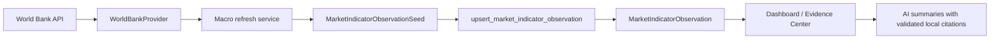

# Design: Online Macro Source Adapters

## Architecture

The MVP should follow the same provider -> service -> script/API -> dashboard evidence pattern already used by the FRED refresh path.

## Boundaries

- Provider boundary: add a World Bank provider under `packages/providers/` that normalizes API response shape into typed observation dataclasses and raises sanitized provider errors.
- Service boundary: add a refresh function that maps World Bank observations to existing `MarketIndicatorObservationSeed` values and writes through the existing upsert path.
- Script boundary: expose the refresh through a small diagnostic CLI similar to `scripts/refresh_fred_macro_indicators.py`.
- UI boundary: use existing dashboard/source-readiness payloads unless a small additive field is needed. The Evidence Center should not call World Bank directly from the browser.
- AI boundary: no AI surface sees World Bank rows until they have been persisted as local observations and included in the existing citation assembly.

## Data Mapping

Initial target mapping:

| Indicator code | World Bank country | Primary World Bank indicator | Meaning |
|---|---|---|---|
| `buffett_indicator_us` | `USA` | `CM.MKT.LCAP.GD.ZS` | Listed domestic companies market cap as percent of GDP |
| `buffett_indicator_cn` | `CHN` | `CM.MKT.LCAP.GD.ZS` | Listed domestic companies market cap as percent of GDP |
| `buffett_indicator_hk` | `HKG` | `CM.MKT.LCAP.GD.ZS` | Listed domestic companies market cap as percent of GDP |

Optional component enrichment:

| World Bank indicator | Use |
|---|---|
| `NY.GDP.MKTP.CD` | GDP current USD context for the same country/year |

The World Bank ratio is already a percentage of GDP. The service should not recompute the ratio unless explicit component data is available and the methodology is recorded. The stored value should use the World Bank ratio value as reported.

## Stored Metadata

Each observation should include at least:

- `provider`: `world_bank`
- `source_name`: `World Bank`
- `country_code`
- `source_indicator_id`
- `source_indicator_name` when available
- `source_url` or `api_url`
- `source_observation_date`
- `retrieved_at`
- `methodology`: e.g. "World Bank CM.MKT.LCAP.GD.ZS, market capitalization of listed domestic companies as percent of GDP."
- optional `gdp_current_usd` and `gdp_source_indicator_id` when fetched

This metadata must satisfy the existing audit keys required by the market-indicator seed import contract.

## Source Readiness Shape

Current source readiness has a manual Buffett component item. The MVP can either:

1. Update that item to mention World Bank adapter support while preserving manual seed fallback; or
2. Add a distinct `world_bank_buffett_indicator` readiness item.

Recommended: add a distinct World Bank item if the UI remains readable. It makes the online/API path visible without deleting manual seed fallback. The existing manual item can remain for cases where the user reviews or overrides component methodology manually.

## Freshness Policy

World Bank macro data is usually annual and lagged. Freshness should be interpreted as "latest available annual observation", not real-time freshness.

Recommended policy:

- `configured`: at least one local observation exists for the mapped codes.
- `no_data` or adapter diagnostic: provider returns no valid latest values.
- `stale` wording should be avoided unless a concrete annual freshness rule is implemented.
- Missing current-year data is normal and should be described as reporting lag.

## Error Handling

- Missing/null values: skip with diagnostics.
- HTTP timeout or network failure: return WARN/FAIL script output and no writes.
- Unexpected schema: sanitized provider error, no raw payload dump.
- Unknown country/indicator: diagnostic and skip.
- Partial success: write valid observations in a transaction when validation succeeds; diagnostics should list skipped targets.

## Compatibility

- Existing FRED refresh script and tests should remain unchanged.
- Existing manual seed import should remain the fallback for sources without adapters.
- Existing dashboard and assistant citation validation should require no new citation prefix if observations use existing `market_indicator:` citation IDs.
- Existing Evidence Center text around manual seed and Source Notebook may stay, but documentation should make online/API refresh the primary path for this task.

## Trade-Offs

- World Bank first delivers Buffett Indicator evidence quickly and fits existing codes, but it does not solve China monthly CPI/PPI/PMI/M2.
- NBS first would better serve China macro breadth, but current local probing returned HTTP 403 and the public API/access pattern needs validation before it should be promised as production evidence.
- A generic macro adapter abstraction could reduce future duplication, but the first slice should stay close to the existing FRED pattern unless duplication becomes real in implementation.
