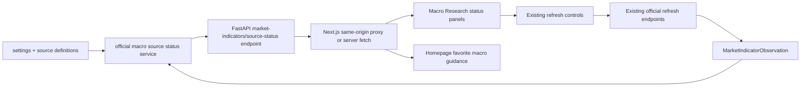

# Macro data source status and refresh guidance UI design

## Architecture

This task adds a small status projection around existing macro evidence and source readiness data.



## Backend Boundary

Prefer a service-layer projection, for example:

- `packages/services/market_indicators.py` or a small adjacent helper for official macro source status;
- FastAPI route under `apps/api/routers/market_indicators.py`, such as `GET /market-indicators/official-sources/status`.

The service should reuse:

- `settings.fred_api_key`, `settings.fred_api_base_url`, `settings.world_bank_api_base_url`;
- existing indicator codes and source group constants where practical;
- current local observations for evidence count and latest as-of;
- existing citation-boundary language from source readiness where practical.

No schema change is required for the recommended MVP.

## Payload Shape

Suggested response:

```json
{
  "status": "degraded",
  "generated_at": "2026-07-08T00:00:00+00:00",
  "providers": [
    {
      "provider": "fred",
      "label": "FRED US macro",
      "configured": false,
      "credential_required": true,
      "credential_label": "FRED_API_KEY",
      "source_frequency": "daily_or_monthly",
      "freshness_policy": "Daily rates; monthly CPI/M2 derived values.",
      "indicator_codes": ["us_10y_yield", "us_2y_yield"],
      "evidence_count": 1,
      "latest_as_of": "2026-07-01",
      "recommended_next_action": "Configure FRED_API_KEY, then run dry-run.",
      "citation_policy": "Only stored local observations are AI-citable."
    }
  ]
}
```

Status semantics:

- `ok`: provider is configured/available and has local observations for all covered indicators.
- `degraded`: provider is available but missing some local observations.
- `needs_configuration`: provider needs configuration before write refresh can work.
- `manual_or_future`: provider has no full official adapter for the requested indicator family.

The exact status names can be refined to match existing badge labels; tests should lock the chosen vocabulary.

## Frontend Design

Macro Research:

- Add a compact source status strip or panel above/beside each official refresh action block.
- Show configured state, latest local as-of, evidence count, covered codes, recommended next action, and annual/lagged note for World Bank.
- Keep buttons visually secondary to the status information, because the user first wants to know what needs attention.

Homepage:

- Reuse market overview payload where possible.
- For missing favorite cards, add a concise next action link:
  - FRED-backed favorites -> Macro Research; if FRED is unconfigured, mention settings/configuration.
  - World Bank-backed Buffett favorites -> Macro Research refresh.
  - China-only unsupported/manual values -> Macro Research/manual source guidance.
- Avoid a new large dashboard section unless the card-level guidance becomes too dense.

## Compatibility

- Existing refresh write endpoints remain unchanged.
- Existing manual seed import remains available but should not become the primary path for official FRED/World Bank data.
- Existing AI citation gates remain unchanged.
- Existing homepage favorite settings remain unchanged.

## Trade-Offs

- This MVP does not persist refresh-run history. This keeps the change small and avoids new schema/workflow complexity.
- The trade-off is that the app cannot say "last dry-run failed at 10:32" after a reload. It can still say whether observations exist and whether the source is configured.
- Persisted history can be added later using `TaskRun` or a new macro refresh event table if the user wants durable operational logs.

## Rollback

The feature is additive. If UI guidance regresses, remove the new status panel/proxy while keeping official refresh endpoints and existing Macro Research refresh controls intact.
