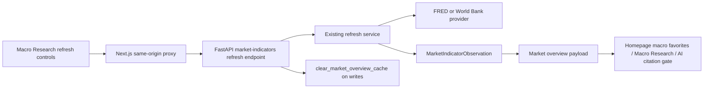

# Macro indicator online refresh status UI design

## Architecture

This task adds a controlled browser mutation layer on top of existing official refresh services.



## Backend Contracts

Use additive endpoints under the existing market-indicators router.

### FRED request

```json
{
  "series": "all",
  "start": "2026-01-01",
  "end": "2026-07-08",
  "latest_only": true,
  "dry_run": true
}
```

Fields:

- `series`: default `all`; accepts existing service group/series/target code values.
- `start` / `end`: optional ISO dates.
- `latest_only`: default `true` for browser workflows.
- `dry_run`: default `true`.

### World Bank request

```json
{
  "target": "all",
  "start_year": 2020,
  "end_year": 2025,
  "latest_only": true,
  "dry_run": true
}
```

Fields:

- `target`: default `all`; accepts existing service group/country/indicator-code values.
- `start_year` / `end_year`: optional integer years.
- `latest_only`: default `true`.
- `dry_run`: default `true`.

### Shared response

```json
{
  "status": "ok",
  "provider": "fred",
  "dry_run": true,
  "observations": 5,
  "fetched": 12,
  "skipped": 0,
  "codes": ["us_10y_yield"],
  "latest_as_of": "2026-07-07",
  "diagnostics": [],
  "cache": {
    "market_overview_cleared": 0
  }
}
```

For dry-run responses, cache clear should be absent or report zero/no-op. For write responses, cache clear should report the result from `clear_market_overview_cache()`.

## Error Handling

- Missing FRED API key should return a safe non-secret error payload and write nothing.
- Provider errors should be sanitized and should not include API keys, raw stack traces, or raw provider payload dumps.
- Invalid dates/years/targets should return client-visible validation errors.
- Write failures should roll back observations through the existing service behavior.

## Frontend Design

Macro Research already has a server-rendered official refresh panel. Add a small client component for per-provider actions.

Proposed component:

- `apps/web/components/official-macro-refresh-actions.tsx`
- Props:
  - provider kind: `fred` or `world_bank`;
  - endpoint path;
  - default payload;
  - localized labels;
  - optional disabled/reason text if needed.

Behavior:

1. Dry-run button sends `dry_run=true`.
2. Write button sends `dry_run=false`.
3. Component shows loading state.
4. Component shows result summary and diagnostics.
5. On successful write, call `router.refresh()` so server-rendered coverage can update.

Keep the existing command examples and runbook panel visible as fallback.

## Compatibility

- No database schema change.
- No new AI citation source type.
- Existing scripts remain the operator fallback and should keep passing tests.
- Existing market-overview consumers continue to load observations through current payloads.

## Risks And Mitigations

- Risk: A write button creates accidental DB changes.
  - Mitigation: separate dry-run and write controls, clear button labels, default dry-run payload, result summary, no scheduler.
- Risk: FRED key missing.
  - Mitigation: return sanitized error and keep manual command/runbook guidance visible.
- Risk: annual World Bank values are mistaken for live market data.
  - Mitigation: UI copy describes them as annual/lagged public macro context.
- Risk: refresh diagnostics become AI evidence.
  - Mitigation: endpoint returns operational result only; dashboard/assistant citations still come only from stored observations.

## Rollback

Backend endpoints and Next proxies are additive. If UI refresh actions regress, remove the client component and restore the existing read-only status panel while keeping service/script refresh paths intact.
