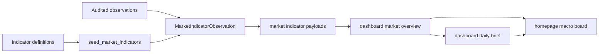

# Design: Macro Valuation Indicators and AI Daily Brief MVP

## Boundary

This is a P0 vertical slice. It should create visible user value without solving the whole source-ingestion problem:

- Use the existing `MarketIndicator` and `MarketIndicatorObservation` model.
- Expand definitions and no-data behavior first.
- Add a deterministic dashboard brief from already available evidence.
- Keep the contract AI-ready for a later citation-aware LLM brief.

## Backend Data Flow



## Indicator Definition Design

Extend `MarketIndicatorDefinition` values in `packages/services/market_indicators.py`.

Suggested P0 codes:

- `buffett_indicator_cn`
- `buffett_indicator_hk`
- `buffett_indicator_us`
- `us_10y_yield`
- `us_2y_yield`
- `us_10y_2y_spread`
- `us_cpi_yoy`
- `us_m2_yoy`
- `cn_m2_yoy`

Definition-only entries are acceptable. No-data is a feature when the source has not been audited.

## Observation Contract

Reuse `MarketIndicatorObservation.components_json`.

Recommended component fields:

- `source_url`
- `source_series_id`
- `retrieved_at`
- `methodology`
- `formula`
- `inputs`
- `freshness_policy`
- `notes`

For manually seeded examples, set `source` and `components_json.notes` so the UI and docs do not imply live production feeds.

## Service Contract

Current payload shape from `get_latest_market_indicator_payload` is close enough:

```json
{
  "code": "us_10y_yield",
  "name": "US 10Y Treasury Yield",
  "region": "US",
  "category": "rates",
  "status": "ok",
  "value": 4.25,
  "unit": "percent",
  "as_of": "2026-07-03",
  "source": "Audited seed: FRED DGS10",
  "components": {
    "source_series_id": "DGS10",
    "methodology": "Daily 10-year Treasury constant maturity rate"
  },
  "no_data_reason": null
}
```

Add helper functions only if they reduce duplication:

- `get_macro_indicator_payloads(session)`
- `get_market_indicator_grouped_payload(session)`
- `build_dashboard_daily_brief(payload)`

## Daily Brief Design

The P0 brief should be deterministic and source-safe.

Payload shape:

```json
{
  "status": "ok",
  "generated_at": "2026-07-06T00:00:00Z",
  "sections": [
    {
      "id": "what_changed",
      "title": "What changed",
      "items": []
    }
  ],
  "citations": [],
  "diagnostics": []
}
```

It can initially live inside `market_dashboard.py` if small. If the logic grows, create `packages/services/dashboard_brief.py`.

Brief rules:

- Prefer facts already loaded in the market overview payload.
- Mention no-data states explicitly.
- Use neutral research language.
- Do not call anything "real-time" unless source metadata proves it.
- Do not output buy/sell/hold instructions.

## Frontend Design

Update `apps/web/app/[locale]/page.tsx` conservatively:

- Keep the existing dashboard structure.
- Rename/copy hierarchy toward macro/valuation and AI summary.
- Group valuation/macro indicators by category if payload supports it.
- Add or reserve a daily brief panel near the top.
- Keep source/as-of/no-data text near each indicator value.

Update `apps/web/messages/en.json` and `apps/web/messages/zh.json` for new text.

## Documentation Design

README:

- Reframe opening description.
- Update key features.
- Update phase table to call macro/valuation and AI summary P0.

User manual:

- Add macro/valuation board section.
- Add daily brief section.
- Revise professional comparison into information aggregation and AI research comparison.

## Compatibility

- Existing API consumers should continue to receive `valuation_indicators.items`.
- Additional fields may be additive only.
- Existing tests for dashboard market overview should continue to pass after updating expected counts.

## Rollback

The safest rollback is to remove new definitions, remove the daily brief UI/API additions, and revert documentation. Existing Buffett Indicator definitions and no-data behavior should remain intact.
