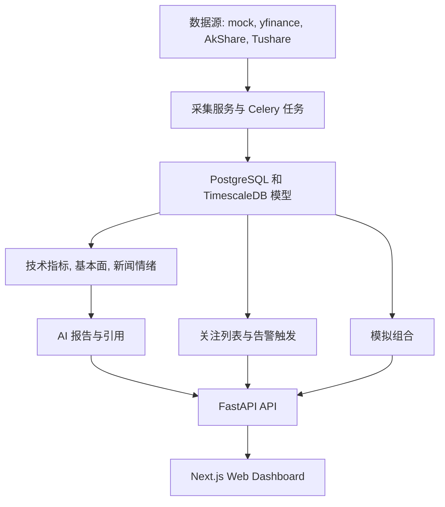

# 股票分析平台当前实现与缺口闭环计划

> **For agentic workers:** REQUIRED SUB-SKILL: Use superpowers:subagent-driven-development or superpowers:executing-plans if this plan is later implemented task-by-task. This document is a status and gap-closure plan, not investment advice.

**Goal:** 深度整理当前股票分析平台已经落地的能力、仍未闭环的内容、文档与代码偏差，并把后续工作拆成可验证、可追踪的执行路径。

**Architecture:** 继续沿用模块化单体架构：FastAPI API、Celery Worker、SQLAlchemy/Alembic 数据层、Next.js 前端、Provider 适配层、Analytics/AI 服务层。短期重点不是重写架构，而是把已实现状态、验收标准、真实数据源、任务审计、数据血缘和前端交互补齐。

**Tech Stack:** Python 3.12、FastAPI、SQLAlchemy、Alembic、Celery、Redis、PostgreSQL/TimescaleDB、pandas、yfinance、AkShare/Tushare 可选、Next.js App Router、React、TypeScript、next-intl、Tailwind、Recharts、pytest、Vitest。

---

## 1. 当前实现总览

当前项目是内部股票研究平台，不是实盘交易系统。当前主线是：多市场标的管理 -> 行情采集/持久化 -> 指标/基本面/新闻情绪分析 -> AI 日报/报告 -> 自选股提醒 -> 模拟组合 -> 前端展示与异步任务追踪。



核心证据：

- 项目说明：[README.md](../../../README.md)
- 术语表：[CONTEXT.md](../../../CONTEXT.md)
- 详细设计：[docs/superpowers/specs/2026-06-29-stock-analysis-platform-design.md](../specs/2026-06-29-stock-analysis-platform-design.md)
- 本地开发手册：[docs/runbooks/local-development.md](../../runbooks/local-development.md)
- MVP 验收：[docs/runbooks/mvp-acceptance.md](../../runbooks/mvp-acceptance.md)
- 最新计划：[docs/superpowers/plans/2026-07-01-priority-5-6-7.md](2026-07-01-priority-5-6-7.md)

## 2. 已实现能力矩阵

| 领域 | 当前能力 | 主要路径 | 状态判断 |
|---|---|---|---|
| 工程骨架 | Python 后端、Next.js 前端、Docker Compose、CI、runbook | [pyproject.toml](../../../pyproject.toml), [package.json](../../../package.json), [docker-compose.yml](../../../docker-compose.yml), [.github/workflows/ci.yml](../../../.github/workflows/ci.yml) | 已具备 MVP 基础 |
| API 入口 | FastAPI 挂载 health、instruments、market-data、indicators、fundamentals、news、reports、analysis、ingestion、watchlist、alerts、portfolios、task-runs、settings | [apps/api/main.py](../../../apps/api/main.py), [apps/api/routers](../../../apps/api/routers) | 已具备主要路由 |
| 数据模型 | 市场、交易所、标的、日线、分钟线、指标、基本面快照、新闻、情绪、报告、自选股、组合、告警、任务运行 | [packages/domain/models.py](../../../packages/domain/models.py), [alembic/versions](../../../alembic/versions) | MVP 模型已落地，设计目标未完全覆盖 |
| 行情 Provider | mock、yfinance、AkShare、Tushare 适配 | [packages/providers](../../../packages/providers), [packages/services/ingestion.py](../../../packages/services/ingestion.py) | 已接入，命名和 fallback 需整理 |
| 技术指标 | MA、RSI、BOLL、ATR 等计算与持久化 | [packages/analytics/indicators.py](../../../packages/analytics/indicators.py), [packages/services/indicators.py](../../../packages/services/indicators.py) | MVP 已实现 |
| 基本面 | PE、营收增速、净利率、资产负债率，DB 优先，mock/yfinance fallback | [packages/analytics/fundamentals.py](../../../packages/analytics/fundamentals.py), [packages/services/fundamentals.py](../../../packages/services/fundamentals.py) | MVP 已实现，财报规范化不足 |
| 新闻舆情 | 新闻 ingest、去重、情绪分类、报告引用 | [packages/services/news.py](../../../packages/services/news.py), [packages/analytics/sentiment.py](../../../packages/analytics/sentiment.py) | MVP 已实现，真实源质量需治理 |
| AI 报告 | 个股日报、关注列表报告、引用来源、mock/openai-compatible provider | [packages/ai](../../../packages/ai), [packages/services/reports.py](../../../packages/services/reports.py), [apps/api/routers/reports.py](../../../apps/api/routers/reports.py) | MVP 已实现，审计链需确认 |
| Watchlist/Alerts | 关注列表、alert_rules、价格/RSI 规则、告警触发历史 | [packages/services/watchlists.py](../../../packages/services/watchlists.py), [packages/services/watchlist_alerts.py](../../../packages/services/watchlist_alerts.py), [packages/services/alert_triggers.py](../../../packages/services/alert_triggers.py) | 已部分落地，交互和去重语义需验收 |
| Portfolio | 多组合 CRUD、持仓、demo fallback、AI 组合建议边界 | [packages/services/portfolios.py](../../../packages/services/portfolios.py), [apps/api/routers/portfolios.py](../../../apps/api/routers/portfolios.py) | 模拟持仓已实现，非完整组合账本 |
| Task Runs | Celery 任务记录、状态、详情、重试、stale running 处理 | [packages/services/task_runs.py](../../../packages/services/task_runs.py), [apps/api/routers/task_runs.py](../../../apps/api/routers/task_runs.py), [apps/worker](../../../apps/worker) | 已实现，术语需统一 |
| 前端 Dashboard | i18n、首页、标的详情、报告中心、组合、自选股、任务、告警、设置 | [apps/web/app/[locale]](../../../apps/web/app/%5Blocale%5D), [apps/web/components](../../../apps/web/components), [apps/web/messages](../../../apps/web/messages) | MVP 页面已落地，测试和 UX 缺口需补齐 |

## 3. 历史计划状态矩阵

| 计划文件 | 当前状态 | 已实现证据 | 剩余缺口 | 处理方式 |
|---|---|---|---|---|
| [2026-06-29-stock-analysis-platform.md](2026-06-29-stock-analysis-platform.md) | 大部分已由后续 MVP 实现覆盖 | 后端 API、领域模型、Provider、Analytics、AI、前端页面、测试目录均已存在 | 详细设计里的交易日历、公司行动、完整财报规范化、多用户权限仍未落地 | 标记为基础蓝图，剩余项转入 schema/data lineage backlog |
| [2026-06-29-real-market-data-provider.md](2026-06-29-real-market-data-provider.md) | 大部分已实现 | [packages/providers/yfinance_provider.py](../../../packages/providers/yfinance_provider.py), [packages/providers/akshare_provider.py](../../../packages/providers/akshare_provider.py), [packages/providers/tushare_provider.py](../../../packages/providers/tushare_provider.py), [packages/services/ingestion.py](../../../packages/services/ingestion.py) | 旧版 `mock-snapshot` 命名仅作为兼容入口保留 | 已新增 `/ingestion/snapshot`，新代码和文档优先使用 provider-neutral endpoint |
| [2026-06-29-daily-report-watchlist.md](2026-06-29-daily-report-watchlist.md) | 大部分已实现 | [apps/worker/celery_app.py](../../../apps/worker/celery_app.py), [packages/services/reports.py](../../../packages/services/reports.py), [packages/services/watchlists.py](../../../packages/services/watchlists.py) | 每日任务配置和环境变量说明不完整 | 转入 env/docs sync |
| [2026-06-29-celery-beat-scheduling.md](2026-06-29-celery-beat-scheduling.md) | 大部分已实现 | [apps/worker/celery_app.py](../../../apps/worker/celery_app.py), [tests/worker/test_celery_schedule.py](../../../tests/worker/test_celery_schedule.py) | README 与 runbook 中 Celery app 路径不一致 | 统一为 `apps.worker.celery_app.celery_app` |
| [2026-06-29-task-run-observability.md](2026-06-29-task-run-observability.md) | 大部分已实现 | [packages/services/task_runs.py](../../../packages/services/task_runs.py), [apps/api/routers/task_runs.py](../../../apps/api/routers/task_runs.py), [tests/api/test_task_runs_api.py](../../../tests/api/test_task_runs_api.py) | 需确认报告和任务详情双向链接、retry 语义 | 转入 audit trail checklist |
| [2026-07-01-priority-5-6-7.md](2026-07-01-priority-5-6-7.md) | 多项已实现但仍为未勾选 | portfolio/watchlist/alerts/fundamentals/news/sparkline/task-run/error-state 相关文件已存在 | 需要逐项验收和文档化 | 本计划作为总控文档接管 |
| [2026-07-01-post-merge-stability.md](2026-07-01-post-merge-stability.md) | 已完成或接近完成 | 文档显示已勾选完成 | 无明显新缺口 | 保留为稳定性记录 |

## 4. `Priority 5/6/7` 状态初判

| 计划项 | 当前代码证据 | 初判 | 剩余动作 |
|---|---|---|---|
| P5.1 Portfolio `?portfolio=id`、fetch by id、rename/delete | [apps/web/components/portfolio-forms.tsx](../../../apps/web/components/portfolio-forms.tsx), [apps/web/app/api/portfolios/[portfolioId]/route.ts](../../../apps/web/app/api/portfolios/%5BportfolioId%5D/route.ts), [packages/services/portfolios.py](../../../packages/services/portfolios.py) | 可能已大部分实现 | 验证页面查询参数、删除/重命名行为、测试覆盖 |
| P5.2 Watchlist inline alert rule editor | [apps/web/components/watchlist-forms.tsx](../../../apps/web/components/watchlist-forms.tsx), [packages/services/watchlist_alerts.py](../../../packages/services/watchlist_alerts.py), [apps/api/routers/watchlists.py](../../../apps/api/routers/watchlists.py) | 可能已部分实现 | 明确规则 schema、UI 编辑保存、失败提示 |
| P5.3 Alert trigger history | [packages/services/alert_triggers.py](../../../packages/services/alert_triggers.py), [apps/api/routers/alerts.py](../../../apps/api/routers/alerts.py), [apps/web/app/api/alerts/triggers/recent/route.ts](../../../apps/web/app/api/alerts/triggers/recent/route.ts), [apps/web/app/[locale]/alerts/page.tsx](../../../apps/web/app/%5Blocale%5D/alerts/page.tsx) | 已有模型/API/页面 | 验证重复触发、分页、Dashboard card |
| P6.1 yfinance fundamentals ingest | [packages/providers/yfinance_provider.py](../../../packages/providers/yfinance_provider.py), [tests/services/test_fundamentals_yfinance.py](../../../tests/services/test_fundamentals_yfinance.py) | 已有实现 | 验证 analysis refresh 端到端写入 |
| P6.2 yfinance news ingest | [packages/providers/yfinance_provider.py](../../../packages/providers/yfinance_provider.py), [packages/services/news.py](../../../packages/services/news.py), [tests/services/test_news_service.py](../../../tests/services/test_news_service.py) | 已有实现 | 明确缺字段和 fallback 策略 |
| P6.3 Dashboard mini sparkline | [apps/web/components/mini-price-chart.tsx](../../../apps/web/components/mini-price-chart.tsx) | 已有组件 | 验证首页 KPI card 实际使用 |
| P6.4 HK/CN beat schedules | [apps/worker/celery_app.py](../../../apps/worker/celery_app.py), [tests/worker/test_celery_schedule.py](../../../tests/worker/test_celery_schedule.py) | 可能已实现 | 验证 beat schedule 文档和测试 |
| P7.1 report↔task_run links | [packages/domain/models.py](../../../packages/domain/models.py), [apps/web/app/[locale]/task-runs/[taskRunId]/page.tsx](../../../apps/web/app/%5Blocale%5D/task-runs/%5BtaskRunId%5D/page.tsx), [apps/web/app/[locale]/reports/[reportId]/page.tsx](../../../apps/web/app/%5Blocale%5D/reports/%5BreportId%5D/page.tsx) | 字段和页面已出现 | 验证写入生命周期、双向链接、重试行为 |
| P7.2 ErrorState | [apps/web/components/error-state.tsx](../../../apps/web/components/error-state.tsx), [apps/web/components/empty-state.tsx](../../../apps/web/components/empty-state.tsx) | 已有组件 | 验证关键页面采用情况 |
| P7.3 README/runbook docs | [README.md](../../../README.md), [docs/runbooks/local-development.md](../../runbooks/local-development.md) | 已更新部分 | 统一 Celery 命令、补 env 矩阵 |

## 5. API 命名清理计划

真实 yfinance 采集现在应通过 provider-neutral endpoint 表达，避免把真实 provider 采集误标成 mock。本轮引入并采用以下入口：

- 新入口：`POST /ingestion/snapshot`
- 兼容入口：`POST /ingestion/mock-snapshot`
- Next.js 新代理：`POST /api/ingestion/snapshot`
- Next.js 兼容代理：`POST /api/ingestion/mock-snapshot`

服务层以 [packages/services/ingestion.py](../../../packages/services/ingestion.py) 中 `ingest_market_snapshot` 作为主入口，`ingest_mock_market_snapshot` 只保留为兼容 wrapper。

## 6. 任务、报告、告警审计闭环

术语统一：实现层已采用 `task_runs`，详细设计中的 `job_runs` 视为早期设计名。后续文档应以 `task_runs` 为 canonical term。

待验收清单：

1. 报告生成任务创建 `TaskRun`。
2. 报告保存时写入 `GeneratedReport.task_run_id`。
3. task-run detail 能跳转到 report detail。
4. report detail 能跳转到 task-run detail。
5. retry 后新旧 task/report 关系明确。
6. alert trigger 需要重复触发策略、分页策略和保留策略。

相关文件：

- [packages/domain/models.py](../../../packages/domain/models.py)
- [packages/services/task_runs.py](../../../packages/services/task_runs.py)
- [packages/services/reports.py](../../../packages/services/reports.py)
- [packages/services/alert_triggers.py](../../../packages/services/alert_triggers.py)
- [apps/api/routers/task_runs.py](../../../apps/api/routers/task_runs.py)
- [apps/api/routers/reports.py](../../../apps/api/routers/reports.py)
- [apps/api/routers/alerts.py](../../../apps/api/routers/alerts.py)

## 7. 数据血缘和 schema hardening 路线图

详细设计要求行情、财报、新闻、AI 报告保留来源和数据截止时间；当前 MVP 模型已可运行，但和目标 schema 有差距。

分阶段路线：

1. 为 `bars_1d` / `bars_1m` 设计 `source_id`、`adjustment_type` 迁移。
2. 引入交易日历能力，用于采集调度、缺口检测、市场开闭判断。
3. 引入公司行动能力，支持复权、分红、拆股和后续回测。
4. 将 `FundamentalSnapshot` 逐步演进为 `financial_statements` + `fundamental_metrics` 双层模型。
5. 强化新闻和报告引用的 source lineage，避免 mock fallback 污染真实报告。

不建议在当前 MVP gap closure 中一次性重写全部 schema；这些应拆成独立 epic。

## 8. 真实数据源 readiness

| Provider | 行情 | 基本面 | 新闻 | 认证 | 推荐用途 | 风险 |
|---|---|---|---|---|---|---|
| mock | 支持固定样例 | 支持 fixture fallback | 支持 fixture | 不需要 | 本地测试、CI、演示 | 不能代表真实市场 |
| yfinance | 支持 US/HK/CN 部分标的 | 可通过 `.info` 获取部分字段 | 可获取 headline 类信息 | 不需要 | 研究、开发、MVP | 字段变化、限流、授权不确定 |
| AkShare | A 股能力较强 | 视接口而定 | 视接口而定 | 通常不需要 | A 股研究 | 接口变化、依赖安装、数据质量不稳定 |
| Tushare | A 股能力较强 | 视 token 权限而定 | 视 token 权限而定 | 需要 token | A 股研究和准生产 | token 权限、额度、授权限制 |

规则：

- mock fallback 必须显式标识来源。
- 生产前必须确认数据授权范围。
- Tushare token 缺失或失效应在设置页/API 响应中可见，不应静默失败。
- yfinance 缺字段时应保留缺失状态，不能伪造指标。

## 9. 环境变量矩阵

| Variable | Required | Default | Used By | Example | Notes |
|---|---:|---|---|---|---|
| `APP_ENV` | 否 | `local` | API/Worker | `local` | 区分环境 |
| `DATABASE_URL` | 是 | 本地 Postgres | API/Worker/Alembic | `postgresql+psycopg://...` | 生产必须独立配置 |
| `REDIS_URL` | 是 | 本地 Redis | Celery | `redis://localhost:6379/0` | Worker/Beat 依赖 |
| `MARKET_DATA_PROVIDER` | 否 | `yfinance` | ingestion/analysis | `yfinance` | 支持 mock/yfinance/akshare/tushare |
| `LLM_PROVIDER` | 否 | `mock` | AI reports | `mock` | 生产需 openai-compatible |
| `LLM_API_KEY` | 按 provider | 空 | AI reports | `sk-...` | 不提交真实密钥 |
| `DAILY_REPORT_WATCHLIST` | 否 | `AAPL:US` | Beat reports | `AAPL:US,0700:HK,600519:CN` | 多股票逗号分隔 |
| `DAILY_REPORT_SYMBOL` | 否 | `AAPL` | Beat reports | `AAPL` | 默认个股日报标的 |
| `DAILY_REPORT_MARKET` | 否 | `US` | Beat reports | `US` | 默认个股日报市场 |
| `DAILY_REPORT_START` | 否 | `2026-01-01` | Reports | `2026-01-01` | 默认报告起点 |
| `DAILY_REPORT_END` | 否 | `2026-01-20` | Reports | `2026-01-20` | 默认报告终点 |
| `DAILY_REPORT_MA_WINDOW` | 否 | `3` | Reports/Indicators | `20` | 均线窗口 |
| `DAILY_REPORT_CRON_HOUR` | 否 | `21` | Beat | `21` | Celery beat hour |
| `DAILY_REPORT_CRON_MINUTE` | 否 | `30` | Beat | `30` | Celery beat minute |
| `TASK_RUN_STALE_MINUTES` | 否 | `30` | Task runs | `30` | 运行中任务过期阈值 |
| `TUSHARE_TOKEN` 或平台设置 token | Tushare 需要 | 空 | CN provider | `...` | 不要提交真实 token |
| `API_BASE_URL` | 否 | `http://localhost:8000` | Next proxy | `http://127.0.0.1:8001` | 后端非 8000 端口时设置 |
| `NEXT_PUBLIC_API_BASE_URL` | 否 | `http://localhost:8000` | Web client | `http://127.0.0.1:8000` | 浏览器可见 |

## 10. MVP 验收 traceability

完整 18 项验收映射维护在 [docs/runbooks/mvp-acceptance.md](../../runbooks/mvp-acceptance.md)。该手册应成为判断 MVP 是否通过的唯一入口。

## 11. 前端测试和 UX 缺口

当前已有前端测试：

- [apps/web/app/[locale]/page.test.tsx](../../../apps/web/app/%5Blocale%5D/page.test.tsx)
- [apps/web/app/[locale]/watchlist/page.test.tsx](../../../apps/web/app/%5Blocale%5D/watchlist/page.test.tsx)
- [apps/web/app/[locale]/instruments/[symbol]/page.test.tsx](../../../apps/web/app/%5Blocale%5D/instruments/%5Bsymbol%5D/page.test.tsx)
- [apps/web/app/[locale]/portfolios/page.test.tsx](../../../apps/web/app/%5Blocale%5D/portfolios/page.test.tsx)
- [apps/web/app/[locale]/reports/page.test.tsx](../../../apps/web/app/%5Blocale%5D/reports/page.test.tsx)
- [apps/web/app/[locale]/task-runs/page.test.tsx](../../../apps/web/app/%5Blocale%5D/task-runs/page.test.tsx)

仍建议补齐：

1. alerts 页面测试。
2. Next.js API route proxy 失败路径测试。
3. ErrorState/EmptyState 在关键页面的采用情况测试。
4. i18n key 覆盖和中英文一致性检查。
5. 移动端导航和响应式 smoke check。

## 12. 后续验收命令

```bash
python -m pytest -v
npm run test:web
python scripts/mvp_acceptance.py
python scripts/verify_celery.py
```

手动 smoke：

```bash
curl http://localhost:8000/health
curl http://localhost:8000/instruments
curl http://localhost:8000/watchlist
curl http://localhost:8000/portfolios
curl http://localhost:8000/task-runs/recent
curl http://localhost:8000/alerts/triggers/recent
```
