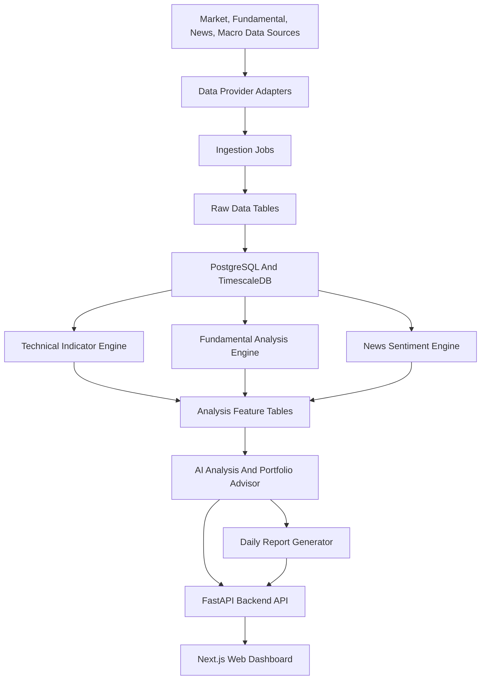
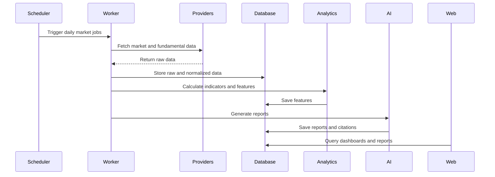

# 股票分析平台详细设计

## 1. 设计目标

本系统面向团队内部研究使用，覆盖 A股、港股、美股，支持延迟行情采集、技术指标计算、基本面分析、新闻舆情分析、AI 个股/组合报告、模拟组合建议和 Web Dashboard 展示。

第一阶段目标不是构建高频交易终端，也不接入实盘券商交易接口，而是打通以下闭环：

```text
数据采集 -> 标准化入库 -> 指标/舆情/基本面分析 -> AI 报告 -> Web 展示 -> 每日报告
```

## 2. 已确认决策

| 决策项 | 结论 |
|---|---|
| 覆盖市场 | 第一阶段支持 A股、港股、美股 |
| 行情实时性 | 日线 + 分钟级延迟行情，不做毫秒级实时行情 |
| 数据源策略 | 混合适配器层，开发/回测可用免费源，生产接入稳定付费源 |
| 使用对象 | 团队内部少量登录用户 |
| AI 报告边界 | 组合顾问报告，但仅用于模拟组合和研究辅助，不自动下单 |
| 后端路线 | Python FastAPI + Celery/Redis |
| 前端路线 | Next.js/React |
| 数据库路线 | PostgreSQL + TimescaleDB |
| 总体架构 | 模块化单体 + 异步任务 + 可演进服务边界 |

## 3. 总体架构



### 3.1 模块化单体边界

建议第一阶段在一个仓库中按以下边界组织：

| 路径 | 职责 |
|---|---|
| `apps/api` | HTTP API、认证、权限、Dashboard 查询接口 |
| `apps/worker` | 异步任务入口，执行采集、指标计算、新闻抓取和报告生成 |
| `apps/web` | Next.js Web Dashboard |
| `packages/domain` | 市场、标的、行情、新闻、报告、组合等领域模型 |
| `packages/providers` | 行情、财报、新闻、宏观数据源适配器 |
| `packages/analytics` | 技术指标、基本面指标、新闻舆情、组合风险计算 |
| `packages/ai` | LLM Provider、提示词模板、报告生成、引用组装 |
| `packages/shared` | 配置、日志、错误类型、通用工具 |

### 3.2 为什么不一开始做微服务

第一阶段需要快速验证完整价值链路。如果一开始拆成多个独立服务，会过早引入服务发现、分布式追踪、跨服务事务、独立部署、接口版本治理和消息一致性问题。模块化单体可以保留清晰边界，同时降低部署和调试成本。

后续当采集、新闻 NLP、AI 报告或 API 查询出现独立扩缩容需求时，再按模块边界拆分服务。

## 4. 数据库设计

数据库采用 PostgreSQL + TimescaleDB：

- PostgreSQL 管理用户、报告、订阅、模拟组合、任务审计等关系型业务数据。
- TimescaleDB 管理日线、分钟线等时序行情数据。
- 所有事实数据保留来源和数据截止时间，AI 报告必须可追溯。

### 4.1 主数据表

| 表 | 作用 | 关键字段 |
|---|---|---|
| `markets` | 市场定义 | `id`, `code`, `name`, `timezone`, `currency`, `trading_calendar_code` |
| `exchanges` | 交易所定义 | `id`, `market_id`, `code`, `name` |
| `instruments` | 股票/ETF/指数统一证券主表 | `id`, `symbol`, `name`, `market_id`, `exchange_id`, `asset_type`, `currency`, `is_active` |
| `trading_calendars` | 市场交易日历 | `market_id`, `trade_date`, `is_open`, `session_type` |
| `data_sources` | 数据源登记 | `id`, `name`, `type`, `priority`, `license_scope`, `is_active` |

### 4.2 行情与财务表

| 表 | 作用 | 关键字段 |
|---|---|---|
| `bars_1m` | 分钟 K 线，Timescale hypertable | `instrument_id`, `ts`, `open`, `high`, `low`, `close`, `volume`, `amount`, `source_id`, `adjustment_type` |
| `bars_1d` | 日 K 线，Timescale hypertable | `instrument_id`, `trade_date`, `open`, `high`, `low`, `close`, `volume`, `amount`, `source_id`, `adjustment_type` |
| `corporate_actions` | 复权、分红、拆股 | `instrument_id`, `action_date`, `action_type`, `factor`, `cash_amount` |
| `financial_statements` | 财报主表 | `instrument_id`, `period_end`, `statement_type`, `report_date`, `currency`, `raw_payload` |
| `fundamental_metrics` | 标准化基本面指标 | `instrument_id`, `period_end`, `metric_code`, `metric_value`, `source_id` |

### 4.3 分析结果表

| 表 | 作用 | 关键字段 |
|---|---|---|
| `technical_indicators` | 技术指标结果 | `instrument_id`, `timeframe`, `as_of`, `indicator_code`, `params`, `value_json` |
| `news_articles` | 新闻原文与元数据 | `id`, `source_id`, `published_at`, `title`, `url`, `language`, `raw_text`, `dedupe_hash` |
| `news_instrument_links` | 新闻与证券关联 | `article_id`, `instrument_id`, `relevance_score` |
| `sentiment_scores` | 新闻舆情分数 | `article_id`, `instrument_id`, `sentiment`, `confidence`, `model_version` |
| `analysis_features` | 给 AI/策略使用的统一特征 | `instrument_id`, `as_of`, `feature_code`, `feature_value`, `window`, `source_module` |

### 4.4 用户、组合与报告表

| 表 | 作用 | 关键字段 |
|---|---|---|
| `users` | 内部用户 | `id`, `email`, `name`, `role`, `created_at` |
| `watchlists` | 关注列表 | `id`, `user_id`, `name` |
| `watchlist_items` | 关注列表股票 | `watchlist_id`, `instrument_id`, `created_at` |
| `portfolios` | 模拟组合 | `id`, `user_id`, `name`, `base_currency`, `risk_profile` |
| `portfolio_positions` | 模拟持仓 | `portfolio_id`, `instrument_id`, `quantity`, `avg_cost`, `as_of` |
| `portfolio_recommendations` | AI/规则生成的组合建议 | `id`, `portfolio_id`, `as_of`, `recommendation_json`, `risk_summary`, `status` |
| `reports` | AI 报告主表 | `id`, `report_type`, `scope_type`, `scope_id`, `as_of`, `title`, `summary`, `content_markdown`, `model_version`, `status` |
| `report_citations` | 报告引用来源 | `report_id`, `source_type`, `source_id`, `quote`, `url` |
| `report_subscriptions` | 每日报告订阅 | `user_id`, `scope_type`, `scope_id`, `schedule`, `delivery_channel` |
| `job_runs` | 后台任务审计 | `id`, `job_type`, `status`, `started_at`, `finished_at`, `error_message`, `metadata_json` |

### 4.5 数据建模原则

1. 多市场字段必须显式建模，包括 `market_id`、`exchange_id`、`currency`、`timezone`。
2. 日线和分钟线必须幂等写入，重复采集不能产生重复 K 线。
3. 新闻和报告必须保存引用，AI 生成内容不能脱离可验证来源。
4. 财报原始数据和标准化指标同时保留，避免因为标准化过程丢失上下文。
5. 后台任务必须写入 `job_runs`，用于追踪失败、重试和数据质量问题。

## 5. 模块详细设计

### 5.1 数据采集模块

职责：统一接入行情、基本面、新闻和宏观数据源。

核心能力：

- 统一数据源适配器接口。
- 支持数据源优先级和失败切换。
- 支持限流、重试、断点续采。
- 原始数据和标准化数据分层保存。
- 按市场交易日历和时区调度采集任务。

数据源适配器统一抽象：

```text
ProviderAdapter
- fetch_instruments(market, exchange)
- fetch_bars(instrument, timeframe, start, end)
- fetch_fundamentals(instrument, period)
- fetch_news(query, start, end)
```

### 5.2 技术指标模块

职责：从标准化行情中计算趋势、动量、波动率和成交量特征。

第一阶段指标：

- MA
- EMA
- MACD
- RSI
- BOLL
- ATR
- 成交量均线
- 收益率和波动率

输出位置：

- `technical_indicators`：保留指标完整结果和参数。
- `analysis_features`：保留给 AI 和组合分析使用的标准化特征。

### 5.3 基本面分析模块

职责：标准化财报数据，并计算估值、盈利能力、成长性、杠杆和现金流指标。

第一阶段指标：

- PE、PB、PS
- ROE、ROA
- 毛利率、净利率
- 营收增速、净利增速
- 资产负债率
- 经营现金流和自由现金流

多市场注意事项：

- A股、港股、美股财报披露口径不同，原始字段不能强行共用。
- 标准化指标需要记录 `currency`、`period_end`、`report_date` 和 `source_id`。

### 5.4 新闻舆情模块

职责：采集、去重、关联、分类和分析与标的相关的新闻内容。

处理流程：

```text
新闻采集 -> 去重 -> 标的关联 -> 情绪分析 -> 主题分类 -> 写入分析特征 -> 进入 AI 报告上下文
```

关键规则：

- 用 `dedupe_hash` 防止同一新闻多次入库。
- 新闻和标的之间是多对多关系。
- 情绪分数必须保存模型版本和置信度。
- 报告中引用新闻时必须能回链到 `news_articles`。

### 5.5 AI 分析层

职责：把行情、指标、基本面、新闻舆情和模拟组合数据组织成可解释报告。

AI 层必须遵守：

- 不允许直接编造事实。
- 所有事实陈述来自数据库查询结果。
- 报告必须包含数据截止时间。
- 报告必须保存引用。
- 组合建议必须标记为模拟建议，不自动下单。

报告类型：

- 市场日报
- 个股日报
- 模拟组合日报
- 组合建议报告

### 5.6 Web Dashboard

核心页面：

| 页面 | 能力 |
|---|---|
| 登录页 | 团队用户登录 |
| 市场概览 | 指数、涨跌分布、热点新闻、风险提示 |
| 个股详情 | K线、技术指标、基本面、新闻、AI 摘要 |
| 关注列表 | 用户关注标的和关键变化提醒 |
| 模拟组合 | 持仓、收益、风险暴露、AI 调仓建议 |
| 报告中心 | 市场、个股、组合报告与引用来源 |
| 任务监控 | 采集、指标、新闻、报告任务状态 |

## 6. 关键数据流

### 6.1 每日收盘后报告流



### 6.2 分钟级延迟行情流

```text
市场交易时段调度 -> 拉取分钟线 -> 幂等 upsert -> 增量计算指标 -> API 查询 -> Dashboard 展示
```

## 7. MVP 范围

第一版不应覆盖全部股票和全部分析能力，应选择代表性标的池验证主链路：

- A股：沪深300成分股。
- 港股：恒生指数成分股。
- 美股：Nasdaq 100 或 S&P 100。

MVP 必须完成：

1. 多市场标的主数据入库。
2. 日线和分钟线采集入库。
3. 6 到 8 个核心技术指标。
4. 一个新闻源的采集、去重、关联和基础舆情。
5. 个股日报和一个模拟组合日报。
6. Web 展示市场概览、个股详情、关注列表和报告中心。

## 8. 开发顺序

1. 基础工程：后端、前端、数据库、Redis、任务队列、配置、日志、迁移。
2. 主数据与行情：市场、交易所、标的、交易日历、日线、分钟线。
3. 技术指标：MA、EMA、MACD、RSI、BOLL、ATR。
4. 新闻舆情：新闻采集、去重、标的关联、情绪分析。
5. 基本面：财报采集、标准化指标、估值和经营指标。
6. AI 个股报告：结构化上下文、LLM Provider、Markdown 报告、引用保存。
7. 模拟组合顾问：持仓、收益、风险暴露、目标权重、调仓理由。
8. 报告订阅和运维化：定时报告、任务监控、失败重试、数据质量检查。

## 9. 风险与控制

| 风险 | 控制方式 |
|---|---|
| 数据授权风险 | 生产前确认行情、新闻、财报数据授权范围 |
| 多市场复杂度 | 从第一天显式建模市场、交易所、时区、币种和交易日历 |
| AI 幻觉 | 报告事实必须来自数据库，并保存引用和数据截止时间 |
| 投资建议合规 | 第一阶段仅做模拟组合建议，不自动下单 |
| 成本膨胀 | 对分钟线、新闻全文和 LLM 调用设置缓存、批处理和保留策略 |
| 数据质量 | 采集任务写入 `job_runs`，并增加缺口检测和重复检测 |

## 10. 验收标准

MVP 验收时应满足：

1. 用户可以登录 Dashboard。
2. 用户可以查看至少一个 A股、港股、美股标的池。
3. 用户可以查看日线、分钟线和核心技术指标。
4. 用户可以查看个股相关新闻和基础舆情。
5. 系统可以生成个股 AI 报告，且报告包含引用和数据截止时间。
6. 用户可以创建模拟组合并查看组合报告。
7. 管理员可以查看采集、指标和报告任务状态。
8. AI 组合建议不会连接实盘交易，也不会自动下单。
